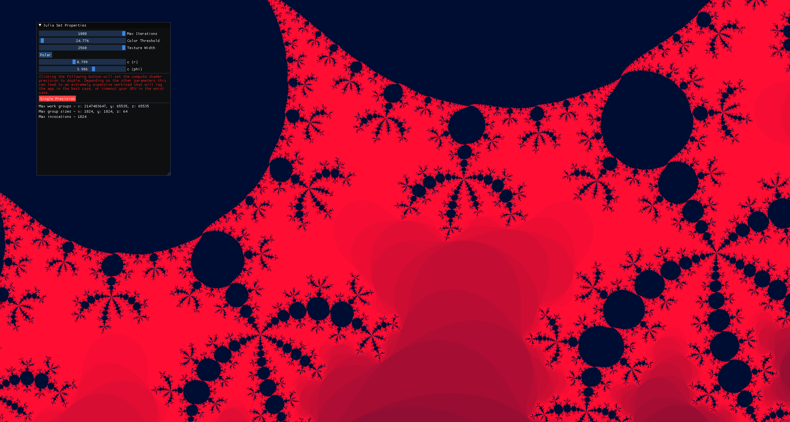

# Julia Sets
A Julia set is the boundary of the set of points that tend to infinity when iterated over a function on the Riemann sphere.

More importantly, it makes pretty shapes.

## Example
This is the Julia set of `f(z) = z² + c` where `c = 0.799 * exp(3.986i)`

